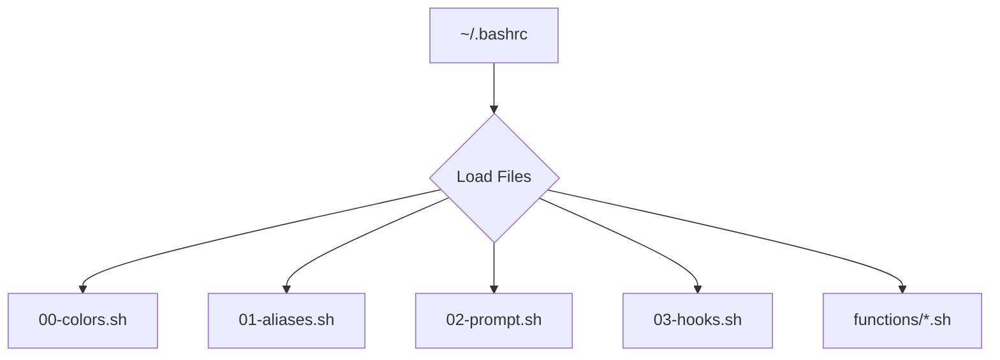

#  Felis Shell - My Personal Dotfiles


Welcome to **Felis Shell**, my personal collection of dotfiles for creating a comfy and powerful command-line setup. I originally built this for Arch Linux, but it should work just fine on other distros like Ubuntu and Debian.

## 🤔 Why I Made This

Honestly, I'm lazy. I got tired of forgetting command-line shortcuts and complex commands for different tools. Felis Shell is my attempt to automate all that stuff away so I can have an easier and more enjoyable time in the terminal. If you're also tired of memorizing everything, maybe you'll find it useful too!

## 📚 The Docs

*   **[Quick Start Guide](docs/quick-start.md)**: Get up and running in 5 minutes.
*   **[How It All Works](docs/architecture.md)**: A look at the high-level design.
*   **[Shell Functions Guide](docs/shell-functions-reference.md)**: A guide to all the custom shell functions.
*   **[Terminal & Fastfetch Setup](docs/terminal-and-fastfetch.md)**: How to set up your terminal, Fastfetch, and Kitty.
*   **[Custom Scripts Guide](docs/custom-scripts.md)**: Info on the custom scripts in `~/.local/bin`.
*   **[Installation & Setup](docs/installation-and-setup.md)**: Detailed installation and customization instructions.
*   **[Troubleshooting](docs/troubleshooting.md)**: Help with common issues.
*   **[Contributing](docs/contributing.md)**: How to contribute to the project.

## 🚀 Quick Start

1.  **Clone and Install:**
    ```bash
    # Clone the repo
    git clone https://github.com/afif25fradana/Felis-Shell-Modular-Dotfile.git /tmp/felis-shell
    # Go into the new folder
    cd /tmp/felis-shell
    # Run the installer
    chmod +x install.sh
    ./install.sh
    ```
    
    You can also see what the installer will do without actually changing anything:
    ```bash
    ./install.sh --dry-run
    ```

2.  **Set Up Your Git Info:**
    Update the `.gitconfig` file with your name and email.
    ```bash
    # The dotfiles are installed to ~/.dotfiles
    cd ~/.dotfiles
    # Open the .gitconfig file and add your info
    nano .gitconfig
    ```

3.  **Reload Your Shell:**
    Open a new terminal or run `source ~/.bashrc` to see the changes.
    ```bash
    source ~/.bashrc
    ```

## ✨ Features

Felis Shell has a bunch of features to make your life easier.

<details>
<summary><strong>Click to see the full feature list</strong></summary>

-   **Modular Design:** Configs are split into small, easy-to-manage files.
-   **Smart Prompt:** A cool, two-line prompt that shows your Git status, Python/Node versions, and more.
    ```
    ┌──(user@host)─[~/Projects/Felis-Shell]─(git:main ✔)
    └─❯
    ```
-   **Modern Commands:** Aliases that use modern tools like `eza` for `ls` and `bat` for `cat`, with fallbacks if they're not installed.
-   **Handy Functions:** A bunch of useful functions like `mkcd` (to make a directory and enter it) and `extract` (to decompress any archive).
-   **Automatic Environment:** Automatically activates Python virtual environments and switches Node.js versions when you `cd` into a project.
-   **Safe Installation:** The `install.sh` script backs up your old dotfiles before it does anything.
-   **Nerd Fonts:** Uses Nerd Font icons to make things look nice.
-   **Lots of Dev Tools:** Plenty of aliases and functions for Git, Docker, Python, and Node.js.

</details>

## 🏗️ How It's Put Together

Everything is loaded in a specific order to make sure it all works correctly.



1.  `~/.bashrc`: The main file that starts everything.
2.  `00-colors.sh`: Sets up the terminal colors.
3.  `01-aliases.sh`: Defines all the command shortcuts.
4.  `02-prompt.sh`: Configures the shell prompt.
5.  `03-hooks.sh`: Manages the "smart" features.
6.  `functions/*.sh`: Loads all the custom shell functions.

For more details, check out the **[How It All Works](docs/architecture.md)** guide.

## 🛠️ What You'll Need

For the best experience, you'll want to have these tools installed. The installer will give you the right commands for your system.

<details>
<summary><strong>Click to see the list of dependencies</strong></summary>

**Core Tools:**
- `eza`, `bat`, `fd`, `ripgrep`, `fzf`, `zoxide`, `btop`/`htop`, `jq`, `unzip`, `unrar`, `p7zip`, `curl`, `netcat`

**Development:**
- `nvm`, `shellcheck`, `docker`, `docker-compose`, `ngrok`, `gh`

**Appearance:**
- `kitty` (recommended terminal), `Nerd Fonts`, `fastfetch`, `cowsay`, `fortune`

</details>

## 🔒 A Note on Security

*   **`sudo`:** Commands that need `sudo` will ask for your password, so you always know when elevated privileges are being used.
*   **Installation:** The `install.sh` script uses your system's package manager to install tools safely.
*   **`shellcheck`:** All the scripts are checked with `shellcheck` to avoid common scripting errors.

## ⚡ Performance

*   **Git Status Caching:** The prompt caches the Git status for a few seconds to keep things fast, even in big repos.
*   **Lazy Loading:** Functions and aliases are loaded efficiently.

## 📜 License

This project is licensed under the MIT License.
