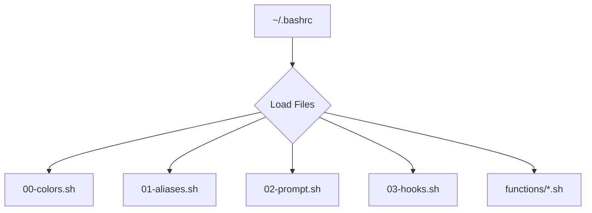

#  Felis Shell - My Awesome Dotfiles 🚀


Hey there! Welcome to **Felis Shell**, my personal stash of modular and super customizable dotfiles. They're here to make your Linux dev setup feel like a superpower. I originally cooked these up for Arch Linux with KDE, but they're built to play nice with pretty much any Linux distro out there—think Ubuntu, Debian, and more.

## ✨ Cool Stuff Inside
<details>
<summary> <strong>Check out what makes Felis Shell awesome!</strong></summary>

Felis Shell is all about boosting your workflow with efficiency, deep customization, and a smooth development experience. Here's a look at its core features:

*   **Modular Structure:** Your configuration is neatly organized into logical files (`colors`, `aliases`, `prompt`, `hooks`, `functions`), making it easy to manage and tweak.
*   **Smart Prompt:** A multi-line prompt that gives you essential info at a glance: Git status, active Python virtual environment, Node.js version, and background job indicators.
*   **Helpful Aliases:** A rich set of command shortcuts, including modern tools like `eza`, `bat`, `fd`, and `rg`, to speed up your terminal workflow.
*   **Powerful Functions:** A library of custom shell functions designed to streamline common development tasks and system maintenance.
*   **Automatic Environment Activation:** Automatically activates Python virtual environments (venv, Poetry, Pipenv) and switches Node.js versions (`.nvmrc`) when you navigate into relevant directories.
*   **Git Integration:** Enhanced Git aliases and a prompt that provides detailed repository status, so you're always in the know.
*   **Kitty Terminal Configuration:** A pre-configured `kitty.conf` featuring the elegant Catppuccin Mocha theme and the functional JetBrains Mono Nerd Font.
*   **Installation Script:** The `install.sh` script automates the setup process, backing up your existing dotfiles and symlinking the new ones.
*   **Nerd Font Support:** Utilizes Nerd Font icons in the prompt and other components for improved visual clarity and aesthetics.
*   **Safety First:** The `install.sh` script includes a robust backup mechanism, and `test_dotfiles.sh` ensures your configuration is stable and safe.
*   **Extensive Development Tooling:** A wide array of aliases and functions tailored for Python, Node.js, Docker, and general web development.
*   **n8n Workflow Integration:** Custom functions and aliases to efficiently manage n8n and ngrok instances.
*   **Randomized Fastfetch Logo:** The `random-fastfetch.sh` script displays a different Fastfetch logo every time you open a new terminal session.
*   **Extensible Hook System:** A powerful hook system allows you to register custom functions to execute on specific shell events, such as directory changes.
*   **User Configuration:** Externalized user-specific configurations in `~/.bashrc.d/user.conf`, enabling easy personalization without modifying core dotfiles.
*   **Enhanced Error Handling:** Improved error handling with `set -o pipefail` in function files, leading to more robust and reliable pipeline operations.
*   **Namespaced Functions:** Internal functions are properly namespaced to prevent naming conflicts with user-defined functions.
*   **Quality Assurance:** Integrated shellcheck analysis within the test suite ensures higher code quality and adherence to best practices.
*   **Comprehensive Dependencies:** A complete list of all required and optional dependencies to get the most out of Felis Shell's features.

</details>

## 🚀 Get Started

Ready to give Felis Shell a spin? Here's how to get up and running:

1.  **Grab the files:**
    ```bash
    git clone https://github.com/afif25fradana/felis-shell.git ~/.dotfiles
    ```

2.  **Run the installer:**
    ```bash
    cd ~/.dotfiles
    ./install.sh
    ```
    This script will back up your existing dotfiles and symlink the new ones.

3.  **Personalize your Git config:**
    ```bash
    # Update .gitconfig with your name and email
    nano ~/.gitconfig
    ```

4.  **Refresh your shell:**
    ```bash
    source ~/.bashrc
    ```
    You're all set!

## Architecture

The shell environment is loaded in a specific order to ensure that dependencies are met and configurations can be overridden cleanly.



1.  `~/.bashrc`: The main entry point. It sources the files from `~/.bashrc.d`.
2.  `~/.bashrc.d/00-colors.sh`: Sets up terminal colors and printing helper functions.
3.  `~/.bashrc.d/01-aliases.sh`: Defines command aliases and environment variables.
4.  `~/.bashrc.d/02-prompt.sh`: Configures the shell prompt.
5.  `~/.bashrc.d/03-hooks.sh`: Sets up shell hooks for automatic environment management.
6.  `~/.bashrc.d/functions/*.sh`: Loads all custom shell functions.

For detailed information about the bash configuration, including usage, customization, and a full list of features, please see the dedicated README file in the `.bashrc.d` directory:

- **[Bash Configuration](.bashrc.d/README.md)**

For information about terminal configuration including fastfetch and kitty, see **[Terminal & Fastfetch Configuration](.bashrc.d/TERMINAL-FASTFETCH.md)**.


## 📜 License

This project is licensed under the MIT License. See the [LICENSE](LICENSE) file for details.
