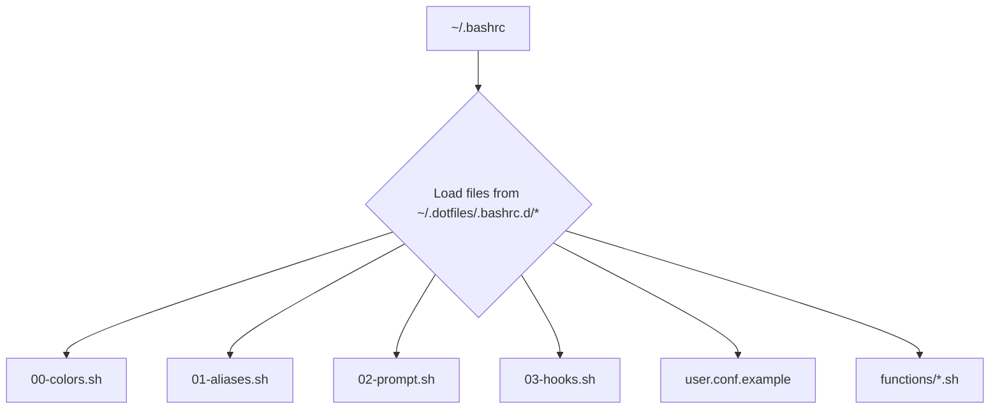

#  Felis Shell - My Personal Dotfiles


Welcome to **Felis Shell**, my personal collection of dotfiles for creating a comfy and powerful command-line setup. I originally built this for Arch Linux, but it should work just fine on other distros like Ubuntu and Debian.

## 🤔 Why I Made This

Honestly, I'm lazy. I got tired of forgetting command-line shortcuts and complex commands for different tools. Felis Shell is my attempt to automate all that stuff away so I can have an easier and more enjoyable time in the terminal. If you're also tired of memorizing everything, maybe you'll find it useful too!

## 📚 The Docs

*   **[Quick Start Guide](docs/quick-start.md)**: Get up and running in 5 minutes.
*   **[How It All Works](docs/architecture.md)**: A look at the high-level design.
*   **[Shell Functions Guide](docs/shell-functions-reference.md)**: A guide to all the custom shell functions.
*   **[Terminal & Fastfetch Setup](docs/terminal-and-fastfetch.md)**: How to set up your terminal, Fastfetch, and Kitty.
*   **[Custom Scripts Guide](docs/custom-scripts.md)**: Info on the custom scripts in `~/.local/bin`.
*   **[Installation & Setup](docs/installation-and-setup.md)**: Detailed installation and customization instructions.
*   **[Troubleshooting](docs/troubleshooting.md)**: Help with common issues.
*   **[Contributing](docs/contributing.md)**: How to contribute to the project.
*   **[Testing & Debugging](docs/testing-debugging.md)**: Guide to testing and debugging your dotfiles.

## 🚀 Quick Start

1.  **Clone and Install:**
    ```bash
    # Clone the repo
    git clone https://github.com/afif25fradana/Felis-Shell-Modular-Dotfile.git /tmp/felis-shell
    # Go into the new folder
    cd /tmp/felis-shell
    # Run the installer
    chmod +x install.sh
    ./install.sh
    ```
    
    You can also see what the installer will do without actually changing anything:
    ```bash
    ./install.sh --dry-run
    ```

2.  **Set Up Your Git Info:**
    Update the `.gitconfig` file with your name and email.
    ```bash
    # The dotfiles are installed to ~/.dotfiles, but you should edit the files in your cloned repository
    cd /tmp/felis-shell # Or wherever you cloned the repository
    # Open the .gitconfig file and add your info
    nano .gitconfig
    ```
    Here is a minimal example of what to add:
    ```ini
    [user]
      name = Your Name
      email = you@example.com
    ```

3.  **Reload Your Shell:**
    Open a new terminal or run `source ~/.bashrc` to see the changes.
    ```bash
    source ~/.bashrc
    ```

## 🧪 Testing & Debugging

Felis Shell includes comprehensive testing and debugging tools to ensure your dotfiles work correctly:

### Test Script
The `test_dotfiles.sh` script provides automated testing for your configuration:
```bash
# Run all tests
./test_dotfiles.sh

# Run with debug mode (pauses between tests)
./test_dotfiles.sh -d

# Run a specific test
./test_dotfiles.sh --run-test syntax

# Get help
./test_dotfiles.sh --help
```

### Debug Script
The `debug_dotfiles.sh` script helps troubleshoot issues:
```bash
# Run debug session
./debug_dotfiles.sh

# Run debug session with verbose output
./debug_dotfiles.sh -v
```

For detailed information about these tools, see the **[Testing & Debugging Guide](docs/testing-debugging.md)**.

## ✨ Features

Felis Shell has a bunch of features to make your life easier.

<details>
<summary><strong>Click to see the full feature list</strong></summary>

-   **Modular Design:** Configs are split into small, easy-to-manage files.
-   **Smart Prompt:** A cool, two-line prompt that shows your Git status, Python/Node versions, and more.
    ```
    ┌──(user@host)─[~/Projects/Felis-Shell]─(git:main ✔)
    └─❯
    ```
-   **Modern Commands:** Aliases that use modern tools like `eza` for `ls` and `bat` for `cat`, with fallbacks if they're not installed.
-   **Handy Functions:** A bunch of useful functions like `mkcd` (to make a directory and enter it) and `extract` (to decompress any archive).
-   **Automatic Environment:** Automatically activates Python virtual environments and switches Node.js versions when you `cd` into a project.
-   **Safe Installation:** The `install.sh` script backs up your old dotfiles before it does anything.
-   **Nerd Fonts:** Uses Nerd Font icons to make things look nice.
-   **Lots of Dev Tools:** Plenty of aliases and functions for Git, Docker, Python, and Node.js.
-   **Testing & Debugging:** Comprehensive tools to validate and troubleshoot your configuration.

</details>

## 🏗️ How It's Put Together

Everything is loaded in a specific order to make sure it all works correctly.



1.  `~/.bashrc`: The main file that starts everything.
2.  `00-colors.sh`: Sets up the terminal colors.
3.  `01-aliases.sh`: Defines all the command shortcuts.
4.  `02-prompt.sh`: Configures the shell prompt.
5.  `03-hooks.sh`: Manages the "smart" features.
6.  `user.conf.example`: An example file for your own custom settings.
7.  `functions/*.sh`: Loads all the custom shell functions.

For more details, check out the **[How It All Works](docs/architecture.md)** guide.

## 🛠️ Dependencies

For the best experience, you'll want to have these tools installed. Here are the commands to install them on different systems.

<details>
<summary><strong>Click to see the installation commands</strong></summary>

### Arch Linux based

*   **Core Tools (daily CLI tools):**
    ```bash
    sudo pacman -S eza bat fd ripgrep fzf zoxide btop htop jq unzip unrar p7zip curl openbsd-netcat ncurses iproute2 net-tools inetutils bzip2 gzip xz cabextract file psmisc the_silver_searcher
    ```
*   **Development Tools (coding & linting tools):**
    ```bash
    sudo pacman -S shellcheck shfmt docker docker-compose github-cli python python-pip git rust python-pytest python-poetry pipenv
    ```
*   **Appearance (terminal eye candy):**
    ```bash
    sudo pacman -S kitty fastfetch cowsay fortune-mod
    ```
*   **AUR Helper (optional, for `yay` or `paru`):**
    ```bash
    # Clones to your home directory to avoid clutter
    cd ~
    # Replace `yay` with `paru` if you prefer
    sudo pacman -S --needed git base-devel && git clone https://aur.archlinux.org/yay.git && cd yay && makepkg -si
    ```

### Ubuntu/Debian based

*   **Core Tools (daily CLI tools):**
    ```bash
    sudo apt update
    sudo apt install eza bat fd-find ripgrep fzf zoxide btop htop jq unzip unrar p7zip-full curl netcat-openbsd ncurses-bin iproute2 net-tools iputils-ping bzip2 gzip xz-utils cabextract file psmisc silversearcher-ag
    ```
*   **Development Tools (coding & linting tools):**
    ```bash
    sudo apt install shellcheck docker.io docker-compose-plugin gh python3 python3-pip git rustc cargo
    ```
*   **Appearance (terminal eye candy):**
    ```bash
    sudo apt install kitty fastfetch cowsay fortune-mod
    ```
*   **Symlinks for `bat` and `fd`:**
    ```bash
    mkdir -p ~/.local/bin
    ln -s /usr/bin/batcat ~/.local/bin/bat
    ln -s /usr/bin/fdfind ~/.local/bin/fd
    ```

### Other Tools (Manual Installation)

*   **nvm (Node Version Manager):**
    ```bash
    curl -o- https://raw.githubusercontent.com/nvm-sh/nvm/v0.39.1/install.sh | bash
    ```
*   **shfmt (Shell Formatter):**
    *Not available in default Ubuntu/Debian repos.* Install via Go or download a binary.
    ```bash
    # Requires Go to be installed
    go install mvdan.cc/sh/v3/cmd/shfmt@latest
    ```
*   **Python Tools (pip):**
    *Use this as an alternative if your distribution's repositories do not have the packages below.*
    ```bash
    pip install pytest poetry pipenv
    ```
*   **ngrok:**
    Download from the [official website](https://ngrok.com/download).
*   **Conda:**
    Download from the [official website](https://docs.conda.io/en/latest/miniconda.html).
*   **Nerd Fonts:**
    Download a font of your choice from the [Nerd Fonts website](https://www.nerdfonts.com/font-downloads) and install it in your system.

</details>

## 🔒 A Note on Security

*   **`sudo`:** Commands that need `sudo` will ask for your password, so you always know when elevated privileges are being used.
*   **Installation:** The `install.sh` script uses your system's package manager to install tools safely.
*   **`shellcheck`:** All the scripts are checked with `shellcheck` to avoid common scripting errors.

## ⚡ Performance

*   **Git Status Caching:** The prompt caches the Git status for a few seconds to keep things fast, even in big repos.
*   **Lazy Loading:** Functions and aliases are loaded efficiently.

## 📜 License

This project is licensed under the MIT License.
