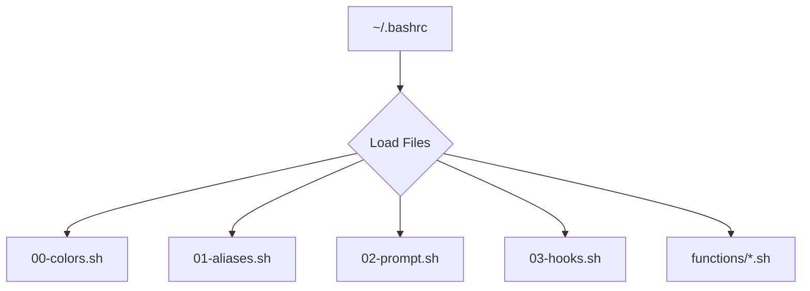

#  Felis Shell - Modular Dotfiles


Welcome to **Felis Shell**, a personal collection of modular and customizable dotfiles designed to create a powerful, efficient, and beautiful command-line experience. Originally built for Arch Linux, it's designed for broad compatibility with other distributions like Ubuntu and Debian.

## 🤔 Why I Built This Project

Honestly? I'm just lazy! I found myself constantly forgetting various command-line shortcuts, complex tool syntaxes, and the specific commands needed for different development environments. Felis Shell was born out of a desire to automate away that mental overhead. It's my personal quest to make my command-line life easier, more efficient, and frankly, more enjoyable. If you're tired of memorizing everything and just want things to *work*, you're in the right place! (Maybe lol)

## 📚 Documentation

*   **[Quick Start Guide](docs/quick-start.md)**: Get up and running in under 5 minutes.
*   **[Architecture Overview](docs/architecture.md)**: High-level system design and data flow.
*   **[Shell Functions Reference](docs/shell-functions-reference.md)**: Comprehensive documentation for all custom shell functions.
*   **[Terminal & Fastfetch Configuration](docs/terminal-and-fastfetch.md)**: Details on terminal setup, Fastfetch, and Kitty.
*   **[Custom Scripts Reference](docs/custom-scripts.md)**: Documentation for custom scripts in `~/.local/bin`.
*   **[Installation and Advanced Setup](docs/installation-and-setup.md)**: Detailed installation, dependencies, and customization.
*   **[Troubleshooting Guide](docs/troubleshooting.md)**: Common issues and solutions.
*   **[Contributing Guidelines](docs/contributing.md)**: How to contribute, code style, and bug reporting.

## 🚀 Quick Start

Get up and running in minutes.

1.  **Clone and Install:**
    ```bash
    # Clone the repository
    git clone https://github.com/afif25fradana/Felis-Shell-Modular-Dotfile.git ~/.dotfiles
    ```
    ```bash
    # Run the installer
    cd ~/.dotfiles
    chmod +x install.sh
    ./install.sh
    ```

2.  **Configure Git:**
    Update the `.gitconfig` with your personal information.
    ```bash
    cd ~/.dotfiles
    chmod +x install.sh
    ./install.sh
    ```

3.  **Reload Your Shell:**
    Open a new terminal or source your `.bashrc` to apply the changes.
    ```bash
    source ~/.bashrc
    ```

## ✨ Features

Felis Shell is packed with features to streamline your development workflow.

<details>
<summary><strong>Click to see the full feature list</strong></summary>

-   **Modular Architecture:** Configurations are split into logical files (`colors`, `aliases`, `prompt`, `functions`), making customization simple and clean.
-   **Intelligent Prompt:** A dynamic, two-line prompt showing Git status, Python/Node versions, and background jobs.
    ```
    ┌──(user@host)─[~/Projects/Felis-Shell]─(git:main ✔)
    └─❯
    ```
-   **Modern Command Aliases:** Smart aliases for `ls` (uses `eza`), `cat` (uses `bat`), `find` (uses `fd`), and `grep` (uses `rg`), with graceful fallbacks if they aren't installed.
-   **Powerful Functions:** A rich library of shell functions to automate common tasks:
    -   `mkcd`: Create a directory and enter it in one command.
    -   `extract`: Decompress any archive with a single command.
    -   `pyinit` / `nodeinit`: Quickly scaffold new Python or Node.js projects.
-   **Automated Environment:** Automatically activates Python virtual environments and switches Node.js versions (`.nvmrc`) when you `cd` into a project.
-   **Robust Installation:** The `install.sh` script safely backs up your existing dotfiles before creating symlinks.
-   **Nerd Font Integration:** Utilizes Nerd Font icons for a visually informative prompt and listings.
-   **Extensive Development Tooling:** A wide array of aliases and functions for Git, Docker, Python, and Node.js development.

</details>

## 🏗️ Architecture

The shell environment is loaded in a specific order to ensure a predictable and extensible setup.



1.  `~/.bashrc`: The main entry point. It sources all scripts from `~/.bashrc.d`.
2.  `00-colors.sh`: Sets up terminal colors and print helper functions.
3.  `01-aliases.sh`: Defines command aliases and environment variables.
4.  `02-prompt.sh`: Configures the dynamic shell prompt.
5.  `03-hooks.sh`: Manages the hook system for automatic environment changes.
6.  `functions/*.sh`: Loads all custom shell functions.

For more details, see the **[Architecture Overview](docs/architecture.md)**.

## 🛠️ Dependencies

For the best experience, please ensure these dependencies are installed. The installer will provide distribution-specific commands.

<details>
<summary><strong>Click to see the list of dependencies</strong></summary>

**Core CLI Tools:**
- `eza` (for `ls`), `bat` (for `cat`), `fd` (for `find`), `ripgrep` (for `grep`), `fzf`, `zoxide`, `btop`/`htop`, `jq`, `unzip`, `unrar`, `p7zip`

**Development:**
- `nvm`, `shellcheck`, `docker`, `docker-compose`, `ngrok`

**Appearance:**
- `kitty` (recommended terminal), `Nerd Fonts` (e.g., JetBrains Mono), `fastfetch`, `cowsay`, `fortune`

</details>


## 🔒 Security Considerations

Felis Shell aims to enhance your command-line experience securely. Key considerations include:
*   **`sudo` Usage:** Commands requiring `sudo` are explicitly called, ensuring you are aware of elevated privileges.
*   **Dependency Installation:** The `install.sh` script uses your system's package manager, which handles package integrity.
*   **Shellcheck:** Contributions are encouraged to pass `shellcheck` to prevent common shell scripting vulnerabilities.

## ⚡ Performance

Optimizations are built into Felis Shell to maintain a responsive experience:
*   **Git Status Caching:** The intelligent prompt caches Git status for 5 seconds to prevent performance degradation in large repositories.
*   **Lazy Loading:** Functions and aliases are loaded efficiently, only when needed.

## 📜 License

This project is licensed under the MIT License.
