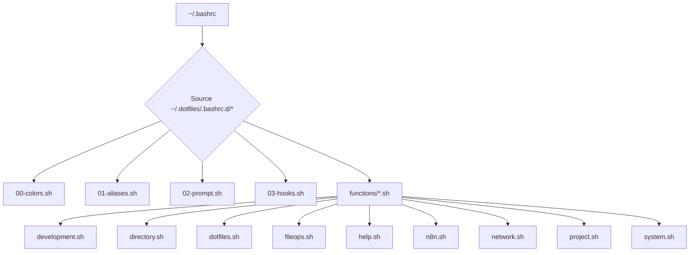

# Architecture Overview

Felis Shell is built with a modular and extensible architecture, designed to provide a powerful yet easy-to-manage command-line experience. This document details the high-level system design, data flow, and the organization of its core components.

## 🎯 Design Principles

*   **Modularity:** Configurations are split into logical, self-contained files, making customization and maintenance straightforward.
*   **Extensibility:** A robust hook system allows for easy integration of new features and custom scripts.
*   **Performance:** Optimized components, such as Git status caching, ensure a responsive shell experience.
*   **Compatibility:** Designed for broad compatibility across Linux distributions, with graceful fallbacks for dependencies.
*   **Readability:** Clear, well-commented code and a logical file structure enhance understanding and contribution.

## 🏗️ High-Level System Design

The Felis Shell environment is loaded in a specific, predictable order to ensure all components are initialized correctly and can interact seamlessly. The main entry point is `~/.bashrc`, which then sources all configuration files from the `~/.dotfiles/.bashrc.d` directory.

## 📁 Component Breakdown

### 1. `~/.bashrc` (Main Entry Point)
This file is the primary configuration file for the Bash shell. It's responsible for:
*   Setting basic shell options.
*   Sourcing the `install.sh` script if it exists (for initial setup).
*   Sourcing all modular configuration files from `~/.dotfiles/.bashrc.d/`.

### 2. `00-colors.sh` (Colors & Styling)
*   **Purpose:** Defines the color palette and provides helper functions for printing colored messages to the terminal.
*   **Details:** Uses the Sweet Theme palette with 256-color support and fallbacks for broader compatibility. Includes semantic colors (e.g., `C_SUCCESS`, `C_ERROR`) and helper functions like `print_success`, `print_error`.

### 3. `01-aliases.sh` (Aliases & Environment)
*   **Purpose:** Contains a comprehensive collection of aliases for frequently used commands and sets essential environment variables.
*   **Details:** Includes aliases for navigation (`..`, `ll`), enhanced CLI tools (`ls` with `eza`, `cat` with `bat`), package management, development tools (Python, Node.js, Docker, Git), and system utilities. Features graceful fallbacks if enhanced tools are not installed.

### 4. `02-prompt.sh` (Intelligent Prompt)
*   **Purpose:** Configures the dynamic, multi-line shell prompt to provide rich, at-a-glance information.
*   **Details:** Displays user@host, current working directory, Git status (with caching for performance), active Python virtual environment, Node.js version, SSH session indicator, background job count, and the exit code of the last command.

### 5. `03-hooks.sh` (Hooks & Integrations)
*   **Purpose:** Implements a powerful shell hook system for automatic environment management and tool integrations.
*   **Details:** Manages auto-activation of Python virtual environments (venv, Poetry, Pipenv, Conda) and Node.js version switching via `.nvmrc`. Integrates with tools like FZF and Zoxide. Provides a generic API (`bashrc_add_hook`, `bashrc_run_hooks`) for registering and executing functions on specific events.

### 6. `functions/` (Custom Shell Functions)
*   **Purpose:** A directory containing a rich library of custom shell functions, organized by category, to automate common tasks and streamline workflows.
*   **Details:**
    *   `development.sh`: Functions for project initialization (`pyinit`, `nodeinit`, `newproject`).
    *   `directory.sh`: Functions for directory operations (`mkcd`, `backup`).
    *   `dotfiles.sh`: Functions for managing dotfiles (`dotfiles`).
    *   `fileops.sh`: Functions for file operations (`extract`).
    *   `help.sh`: The interactive help system (`help`).
    *   `n8n.sh`: Functions for n8n and ngrok workflow (`n8n-start`, `n8n-ngrok`).
    *   `network.sh`: Functions for network operations (`myip`, `portcheck`).
    *   `project.sh`: Functions for project management.
    *   `system.sh`: Functions for system maintenance (`sysclean`, `serv`).
    *   `github.sh`: Functions for GitHub CLI integration (`ghissue`, `ghstatus`).

## 🔄 Data Flow and Interactions

*   **Initialization:** Upon shell startup, `~/.bashrc` sources all modular scripts.
*   **Environment Setup:** `00-colors.sh` and `01-aliases.sh` establish the visual and functional baseline.
*   **Dynamic Prompt:** `02-prompt.sh` continuously updates the prompt based on the current directory, Git status, and active environments.
*   **Automatic Context Switching:** `03-hooks.sh` monitors directory changes (`cd`) and automatically activates/deactivates relevant development environments (Python venvs, Node.js versions).
*   **Function Execution:** Custom functions in `functions/` are available globally and can be called by the user or other scripts.
*   **Dependency Fallbacks:** Aliases and functions are designed with graceful fallbacks, ensuring core functionality even if advanced dependencies are not installed.

This modular structure ensures that Felis Shell is both powerful and easy to manage, allowing users to customize their environment without fear of breaking core functionality.
