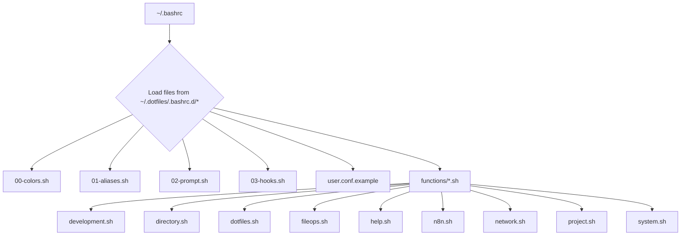

# How It All Works

Felis Shell is built to be modular and easy to tinker with. The goal is to have a powerful command-line setup that's still simple to manage. This doc gives you a quick tour of how all the pieces fit together.

## 🎯 What I Was Goin' For

*   **Keep it Simple:** Configs are split into smaller, logical files. This makes it easy to find what you're looking for and make changes without breaking everything.
*   **Easy to Add Stuff:** A simple hook system lets you add your own scripts and features without a headache.
*   **Keep it Snappy:** Things like Git status caching are used to make sure your prompt is fast and doesn't lag.
*   **Works on Most Systems:** Designed to run on different Linux distros. If a fancy tool is missing, it'll fall back to a basic one.
*   **Easy to Read:** The code is commented and the files are organized logically, so you can figure out what's going on.

## 🏗️ How It Loads Up

When you open your terminal, Felis Shell loads everything in a specific order to make sure it all works together. It starts with your main `~/.bashrc` file, which then pulls in all the config files from the `~/.dotfiles/.bashrc.d` directory.

## 📁 The Different Parts

### 1. `~/.bashrc` (The Starting Point)
This is the main file that kicks everything off. It sets some basic shell options and then loads all the other config files from the `.bashrc.d` directory.

### 2. `00-colors.sh` (Colors & Style)
*   **What it does:** Sets up the color scheme for the terminal and provides easy ways to print colorful messages.
*   **Details:** Uses a nice color theme that works on most terminals. It includes simple color names (like `C_SUCCESS`, `C_ERROR`) and helper functions (`print_success`, `print_error`) to make outputs look good.

### 3. `01-aliases.sh` (Shortcuts & Settings)
*   **What it does:** This is where all the command shortcuts (aliases) live. It also sets up some useful environment variables.
*   **Details:** You'll find shortcuts for common commands like `ll` (for a detailed file list), and it makes tools like `ls` and `cat` better by using modern alternatives (`eza`, `bat`) if they're installed.

### 4. `02-prompt.sh` (The Smart Prompt)
*   **What it does:** This file configures the cool, multi-line prompt that gives you a bunch of info at a glance.
*   **Details:** It shows your username, current folder, Git status (with caching to keep it fast), Python virtual environment, Node.js version, and more.

### 5. `03-hooks.sh` (Automatic Magic)
*   **What it does:** This is where the "smart" features live. It automatically manages your environment as you move around.
*   **Details:** It can auto-activate Python virtual environments or switch your Node.js version when you `cd` into a project. It also integrates with tools like FZF (for fuzzy finding) and Zoxide (for smart directory jumping).

### 6. `functions/` (The Toolbox)
*   **What it does:** This folder is a collection of handy shell functions, sorted into different files by what they do.
*   **Details:**
    *   `development.sh`: Functions to quickly start new projects (`pyinit`, `nodeinit`).
    *   `directory.sh`: Helpers for moving around and making directories (`mkcd`).
    *   `dotfiles.sh`: A tool to backup and restore your dotfiles (`dotfiles`).
    *   `fileops.sh`: A universal `extract` command for any archive.
    *   `help.sh`: The `help` and `shortcut` commands.
    *   `n8n.sh`: Functions to manage n8n and ngrok.
    *   `network.sh`: Tools to check your IP address and open ports (`myip`, `portcheck`).
    *   `project.sh`: A command to create new projects with a nice structure (`newproject`).
    *   `system.sh`: Tools for system cleanup and managing services (`sysclean`, `serv`).
